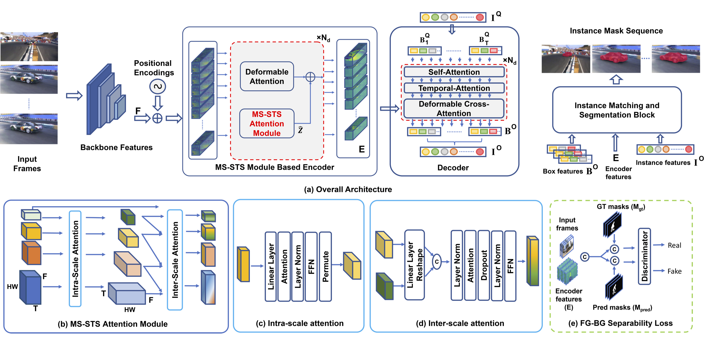
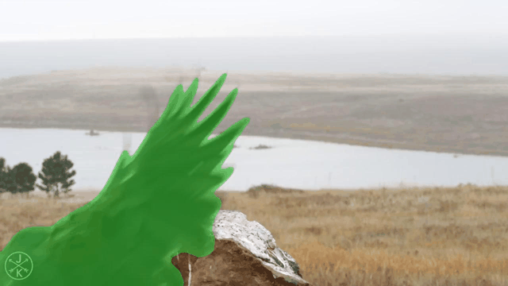
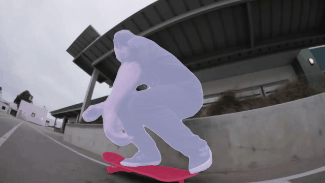
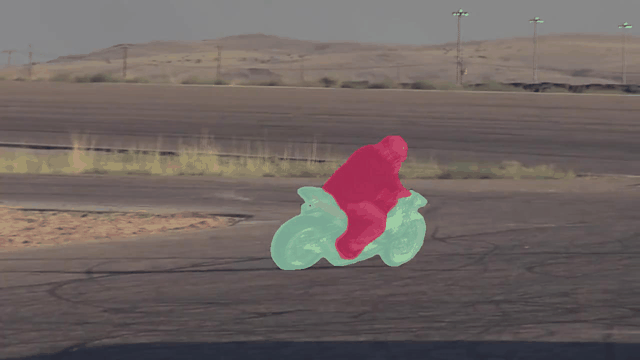
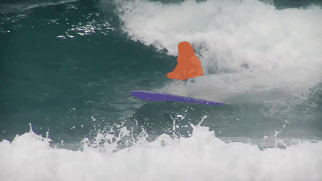
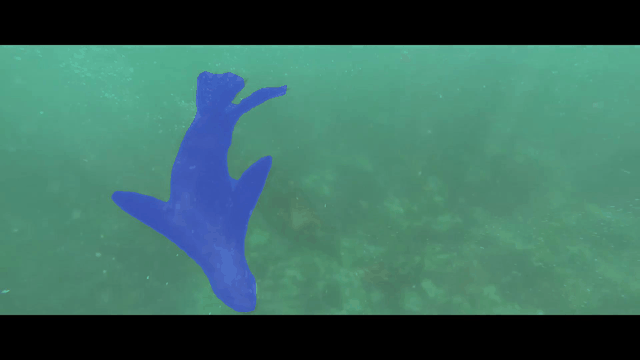

# Video Instance Segmentation via Multi-scale Spatio-temporal Split Attention Transformer

Code will be coming soon !

#### Abstract

State-of-the-art transformer-based video instance segmentation (VIS) approaches typically utilize either single-scale spatio-temporal features or per-frame multi-scale features during the attention computations. We argue that such an attention computation ignores the multi-scale spatio-temporal feature relationships that are crucial to tackle target appearance deformations in videos. To address this issue, we propose a transformer-based VIS framework, named MS-STS VIS, that comprises a novel multi-scale spatio-temporal split (MS-STS) attention module in the encoder. The proposed MS-STS module effectively captures spatio-temporal feature relationships at multiple scales across frames in a video. We further introduce an attention block in the decoder to enhance the temporal consistency of the detected instances in different frames of a video. Moreover, an auxiliary discriminator is introduced during training to ensure better foreground-background separability within the multi-scale spatio-temporal feature space. We conduct extensive experiments on two benchmarks: Youtube-VIS (2019 and 2021). Our MS-STS VIS achieves state-of-the-art performance on both benchmarks. When using the ResNet50 backbone, our MS-STS achieves a mask AP of 50.1%, outperforming the best reported results in literature by 2.7% and by 4.8% at higher overlap threshold of AP75, while being comparable in model size and speed on Youtube-VIS 2019 val. set. When using the Swin Transformer backbone, MS-STS VIS achieves mask AP of 61.0% on Youtube-VIS 2019 val. set.

#### Architecture

#### Qualitative results on YouTube-VIS 2019/2021 val. set

### 

####  Quatitative results on YouTube-VIS 2019 val. set

| Model                             | AP   | AP50 | AP75 | AR1  | AR10 |
| --------------------------------- | ---- | ---- | ---- | ---- | ---- |
| MS-STS_r50                         | 50.1 | 73.2 | 56.6 | 46.1 | 57.7 |
| MS-STS_r101                        | 51.1 | 73.2 | 59.0 | 48.3 | 58.7 |
| MS-STS_swin                        | 61.0 | 85.2 | 68.6 | 54.7 | 66.4 |

