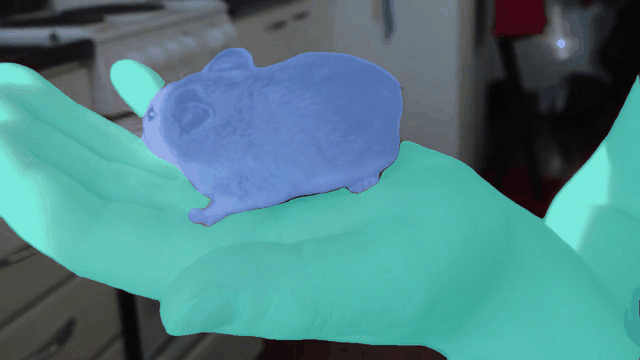

# Video Instance Segmentation via Multi-scale Spatio-temporal Split Attention Transformer

[Omkar Thawakar](https://scholar.google.com/citations?user=flvl5YQAAAAJ&hl=en), [Sanath Narayan](https://scholar.google.co.in/citations?user=Bx7EFGoAAAAJ&hl=en), [Jiale Cao](https://scholar.google.com/citations?user=6pPP1MQAAAAJ&hl=zh-CN), [Hisham Cholakkal](https://scholar.google.com/citations?user=bZ3YBRcAAAAJ&hl=zh-CN), [Rao Muhammad Anwer](https://scholar.google.com/citations?user=_KlvMVoAAAAJ&hl=zh-CN), [Muhammad Haris Khan](https://scholar.google.com/citations?user=ZgERfFwAAAAJ&hl=zh-CN), [Salman Khan](https://salman-h-khan.github.io/), [Michael Felsberg](https://scholar.google.com/citations?user=lkWfR08AAAAJ&hl=zh-CN), [Fahad Shahbaz Khan](https://scholar.google.es/citations?user=zvaeYnUAAAAJ&hl=en) [ ECCV 2022 ]


* **(Code and models are under upload/Fine-Tuning !)**

## :rocket: News

* **(Sept 27, 2022)**
  * Swin pretrained model and result file added.
* **(Sept 16, 2022)**
  * Code Uploaded.
* **(April 3, 2022)**
  * Project repo created.

<hr />

#### Abstract

State-of-the-art transformer-based video instance segmentation (VIS) approaches typically utilize either single-scale spatio-temporal features or per-frame multi-scale features during the attention computations. We argue that such an attention computation ignores the multi-scale spatio-temporal feature relationships that are crucial to tackle target appearance deformations in videos. To address this issue, we propose a transformer-based VIS framework, named MS-STS VIS, that comprises a novel multi-scale spatio-temporal split (MS-STS) attention module in the encoder. The proposed MS-STS module effectively captures spatio-temporal feature relationships at multiple scales across frames in a video. We further introduce an attention block in the decoder to enhance the temporal consistency of the detected instances in different frames of a video. Moreover, an auxiliary discriminator is introduced during training to ensure better foreground-background separability within the multi-scale spatio-temporal feature space. We conduct extensive experiments on two benchmarks: Youtube-VIS (2019 and 2021). Our MS-STS VIS achieves state-of-the-art performance on both benchmarks. When using the ResNet50 backbone, our MS-STS achieves a mask AP of 50.1%, outperforming the best reported results in literature by 2.7% and by 4.8% at higher overlap threshold of AP75, while being comparable in model size and speed on Youtube-VIS 2019 val. set. When using the Swin Transformer backbone, MS-STS VIS achieves mask AP of 61.0% on Youtube-VIS 2019 val. set.


#### Architecture

<p align="center"></p>


##

### Installation

First, clone the repository locally:

```bash
git clone https://github.com/OmkarThawakar/MSSTS-VIS.git
```

Then, create environment and install dependencies:

```bash
conda env create env.yml
```

Install dependencies and pycocotools for VIS:

```bash
pip install -r requirements.txt
pip install git+https://github.com/youtubevos/cocoapi.git#"egg=pycocotools&subdirectory=PythonAPI"
```

Compiling CUDA operators:

```bash
cd ./models/ops
sh ./make.sh
# unit test (should see all checking is True)
python test.py
```

### Data Preparation

Download and extract 2019 version of YoutubeVIS train and val images with annotations from [CodeLab](https://competitions.codalab.org/competitions/20128#participate-get_data) or [YouTubeVIS](https://youtube-vos.org/dataset/vis/), and download COCO 2017 datasets. We expect the directory structure to be the following:

```
MSSTS-VIS
├── datasets
│   ├── coco_keepfor_ytvis19.json
...
ytvis
├── train
├── val
├── annotations
│   ├── instances_train_sub.json
│   ├── instances_val_sub.json
coco
├── train2017
├── val2017
├── annotations
│   ├── instances_train2017.json
│   ├── instances_val2017.json
```


The modified coco annotations 'coco_keepfor_ytvis19.json' for joint training can be downloaded from [[google]](https://drive.google.com/file/d/1dhfxtnu0oiolNyOWjf4CscBgb_tNg-K8/view?usp=sharing).
Taken from SeqFormer.
## 

### Training

We performed the experiment on NVIDIA Tesla V100 GPU. All models are trained with total batch size of 10.

To train model on YouTube-VIS 2019 with 8 GPUs , run:

```
GPUS_PER_NODE=8 ./tools/run_dist_launch.sh 8 ./configs/r50_mssts_ablation.sh
```


To train model on YouTube-VIS 2019 and COCO 2017 jointly, run:

```
GPUS_PER_NODE=8 ./tools/run_dist_launch.sh 8 ./configs/r50_mssts.sh
```


To train swin model on multiple nodes, run:

On node 1:

```
MASTER_ADDR=<IP address of node 1> NODE_RANK=0 GPUS_PER_NODE=8 ./tools/run_dist_launch.sh 16 ./configs/swin_mssts.sh
```

On node 2:

```
MASTER_ADDR=<IP address of node 1> NODE_RANK=1 GPUS_PER_NODE=8 ./tools/run_dist_launch.sh 16 ./configs/swin_mssts.sh
```


### Inference & Evaluation


Evaluating on YouTube-VIS 2019:

```
python3 inference.py  --masks --backbone [backbone] --model_path /path/to/model_weights --save_path results.json 
```

To get quantitative results, please zip the json file and upload to the [codalab server](https://competitions.codalab.org/competitions/20128#participate-submit_results).


#### Qualitative results on YouTube-VIS 2019/2021 val. set

### 





### Model zoo

####  Quatitative results on YouTube-VIS 2019.


| Model                             | AP   | AP50 | AP75 | AR1  | AR10 | Model | Results |
| --------------------------------- | ---- | ---- | ---- | ---- | ---- | ---- | ---- |
| MS-STS_r50                         | 50.1 | 73.2 | 56.6 | 46.1 | 57.7 |[r50](https://github.com/OmkarThawakar/MSSTS-VIS) | [r50_results](https://mbzuaiac-my.sharepoint.com/:u:/g/personal/omkar_thawakar_mbzuai_ac_ae/EVyTvD6QwDNDtSJ-Nwb46uIB599Xl12CWQ0u5T-mE0s6GA?e=NhlZXD)
| MS-STS_r101                        | 51.1 | 73.2 | 59.0 | 48.3 | 58.7 |[r101](https://github.com/OmkarThawakar/MSSTS-VIS) | [r101_results](https://mbzuaiac-my.sharepoint.com/:u:/g/personal/omkar_thawakar_mbzuai_ac_ae/EVyTvD6QwDNDtSJ-Nwb46uIB599Xl12CWQ0u5T-mE0s6GA?e=NhlZXD)
| MS-STS_swin                        | 61.0 | 85.2 | 68.6 | 54.7 | 66.4 |[swin](https://github.com/OmkarThawakar/MSSTS-VIS) | [swin_results](https://mbzuaiac-my.sharepoint.com/:u:/g/personal/omkar_thawakar_mbzuai_ac_ae/ERjpfhMZhqFLscylRx1ACzABqFgOTPnsVjeA46D_t-SiOA?e=0fPvPS)

<hr />

## Citation

```
@article{mssts2022,
      title={Video Instance Segmentation via Multi-scale Spatio-temporal Split Attention Transformer}, 
      author={Omkar Thawakar and Sanath Narayan and Jiale Cao and Hisham Cholakkal and Rao Muhammad Anwer and Muhammad Haris Khan and Salman Khan and Michael Felsberg and Fahad Shahbaz Khan},
      journal={Proc. European Conference on Computer Vision (ECCV)},
      year={2022},
}
```

## Contact
If you have any question, please contact me at omkar.thawakar@mbzuai.ac.ae

## Acknowledgement

This repo is based on [SeqFormer](https://github.com/wjf5203/SeqFormer) , [Deformable DETR](https://github.com/fundamentalvision/Deformable-DETR) and [VisTR](https://github.com/Epiphqny/VisTR). Thanks for their wonderful works.
